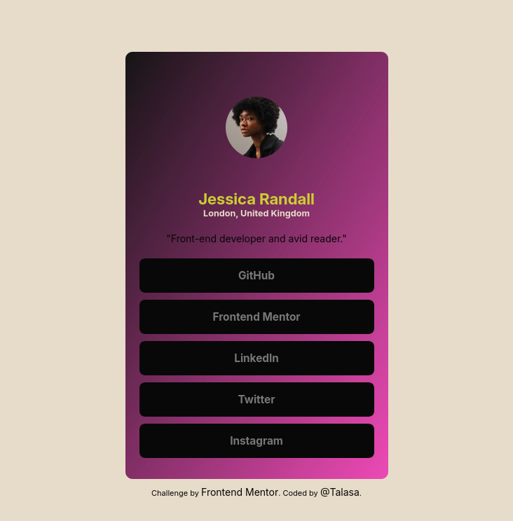

# Frontend Mentor - Social links profile solution

This is a solution to the [Social links profile challenge on Frontend Mentor](https://www.frontendmentor.io/challenges/social-links-profile-UG32l9m6dQ). Frontend Mentor challenges help you improve your coding skills by building realistic projects. 

## Table of contents

- [Overview](#overview)
  - [The challenge](#the-challenge)
  - [Screenshot](#screenshot)
  - [Links](#links)
- [My process](#my-process)
  - [Built with](#built-with)
  - [What I learned](#what-i-learned)
  - [Continued development](#continued-development)
  - [Useful resources](#useful-resources)
- [Author](#author)

## Overview

### The challenge

Users should be able to:

- See hover and focus states for all interactive elements on the page

### Screenshot

### Links

- Solution URL: [https://github.com/TalasaDev/FrontendMentor-social-link-profile](https://github.com/TalasaDev/FrontendMentor-social-link-profile)
- Live Site URL: [https://talasadev.github.io/FrontendMentor-social-link-profile/]( https://talasadev.github.io/FrontendMentor-social-link-profile/)

## My process

### Built with

- Semantic HTML5 markup
- CSS custom properties
- Flexbox

### What I learned

This challenge allow me to focus in buttons states and palette colors. It's was fun.

### Continued development

SASS and a CSS framework will be the next step.

### Useful resources

- [Html Color Codes](https://html-color.codes/gold) - Interesting resource color codes.
- [Color Designer](https://colordesigner.io/convert/hsltohex) - This is an amazing website that converts HEX color codes to hsl and vice versa.
- [Color Meanings] (https://www.color-meanings.com/retro-color-palettes/). Retro color palettes for throwback. 

## Author

- Website - [Add your name here](https://www.your-site.com)
- Frontend Mentor - [@TalasaDev](https://www.frontendmentor.io/profile/TalasaDev)
- Twitter - [@TalasaWeb35739](https://x.com/TalasaWeb35739)
